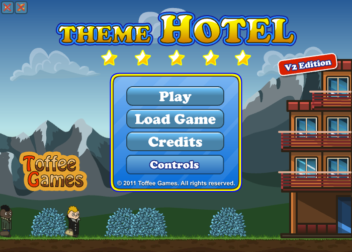
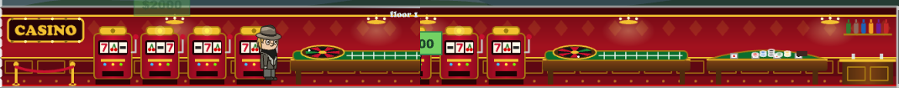
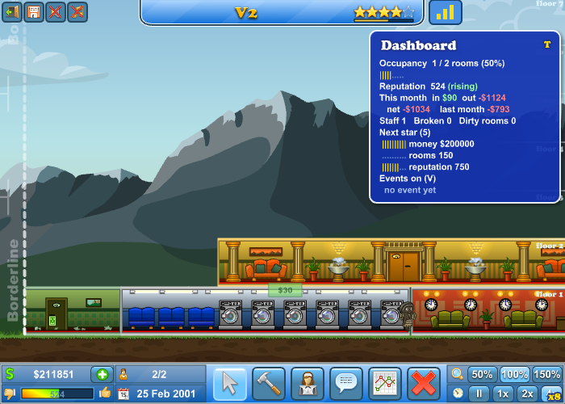
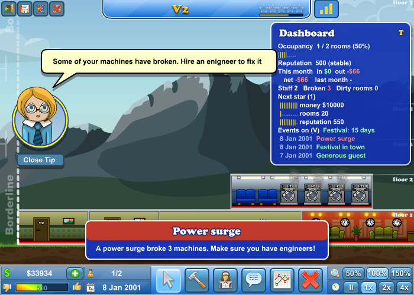
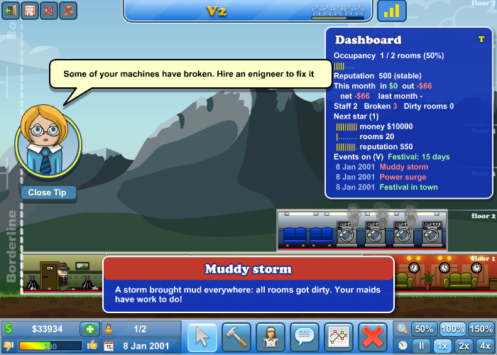
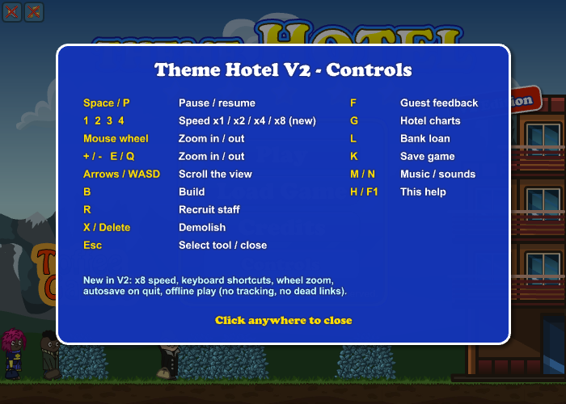
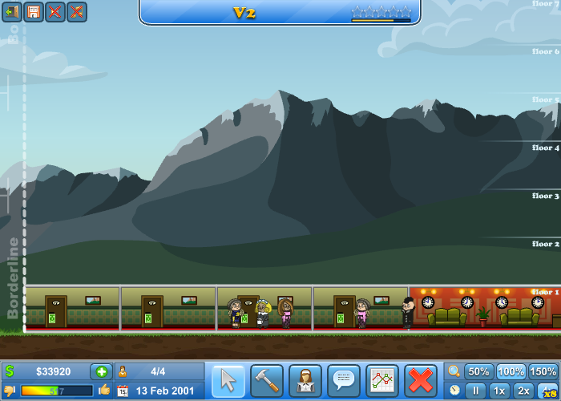

# Theme Hotel — Édition V2 (réédition)

Réédition du jeu Flash **Theme Hotel** (Toffee Games, 2011).
Le SWF original a été décompilé, les classes AS3 concernées ont été modifiées
puis recompilées dans le SWF d'origine : graphismes, sons, équilibrage et
sauvegardes restent 100 % identiques, seuls le confort de jeu et les liens
morts changent.

**Le jeu V2 : [`dist/theme-hotel-v2.swf`](dist/theme-hotel-v2.swf)**
(l'original est conservé dans [`original/theme-hotel-v1.swf`](original/theme-hotel-v1.swf)).



## Nouveautés de la V2

| | Nouveauté |
|---|---|
| ⏩ | **Vitesse x8** (touche `4`) — simulée en sous-pas x4 pour garder la même stabilité que le jeu d'origine |
| ⌨️ | **Raccourcis clavier** pour toutes les actions (voir tableau ci-dessous) |
| 🖱️ | **Zoom à la molette** (le code existait dans la V1 mais n'avait jamais été branché) |
| ❓ | **Écran d'aide** des contrôles : bouton *Controls* du menu, ou `H` / `F1` en jeu (met le jeu en pause) |
| 💾 | **Sauvegarde automatique en quittant** vers le menu (emplacement *Autosave*), en plus de celle de chaque début de mois |
| 🔌 | **Jeu 100 % hors-ligne** : suppression du pistage (`track.g-bot.net`) et des liens vers le portail disparu `gamesfree.com` |
| 🚀 | **Démarrage plus rapide** : l'écran pub du sponsor est sauté |
| 🏷️ | Menu remis en page : badge « V2 Edition », *Credits* remonté, nouveau bouton *Controls* à la place de *More Games* |
| 📊 | **Tableau de bord** (V2.1) : touche `T` ou bouton en haut à droite |
| 🎲 | **Événements aléatoires** (V2.1) : bus de touristes, festival, célébrité, inspecteur, panne de courant, tempête de boue, pourboire |

### Nouveaux bâtiments (V2.2)

| Bâtiment | Où | Débloqué | Coût | Entretien / mois | Prix |
|---|---|---|---|---|---|
| 🛏️ **Chambre économique** | Construire → Rooms | dès le départ | $250 | $10 | $4 / nuit (standard : $6) |
| 👑 **Suite royale** | Construire → Rooms | 4 étoiles | $18 000 | $700 | $180 / nuit (présidentielle : $90) |
| 🧺 **Lingerie industrielle** | Construire → Service | 1 étoile | $3 000 | $120 | $30 / lavage |

- La **lingerie industrielle** a 6 machines au lieu de 4 et occupe 6 cases au
  lieu de 4 (1,5× la laverie). Son décor est recomposé à partir de celui de la
  laverie : 3 rangées de sièges et 6 machines animées, qui peuvent tomber en
  panne comme les originales.
- La **chambre économique** reprend le décor de la chambre standard, teinté vert
  pâle ; la **suite royale** celui de la suite présidentielle, en doré.
- Pour le jeu, ces bâtiments comptent comme leur modèle : les clients qui
  veulent une laverie vont à la lingerie industrielle, ceux qui veulent une
  suite présidentielle acceptent la suite royale, etc. Dans les statistiques
  (onglet *Rooms*), ils sont ajoutés à la ligne du bâtiment d'origine.
- Les sauvegardes contenant ces bâtiments ne s'ouvrent pas dans la V1.

### 🎰 Casino (V2.3)

Salle de 8 cases, rouge et or, entièrement dessinée en code (pas d'image
ajoutée) : enseigne « CASINO » à ampoules clignotantes, cordon de velours,
4 machines à sous (rouleaux 7 / cerise / BAR, lumières qui clignotent),
table de roulette avec roue et bille animées, table de blackjack (cartes,
jetons, sabot), bar avec bouteilles, lustres dorés. 8 places de jeu, chacune
peut tomber en panne. Construire → Entertainment, débloqué à **4 étoiles**.



**Équilibrage.** Tous les divertissements du jeu d'origine suivent la même
règle : coût de construction ≈ 37-40 × le prix d'une visite, et entretien
mensuel ≈ 1,5-1,6 × ce prix.

| Divertissement | Étoiles | Prix / visite | Construction | Entretien / mois | Construction ÷ prix | Entretien ÷ prix |
|---|---|---|---|---|---|---|
| Arcade | 1 | $270 | $10 000 | $400 | 37 | 1,48 |
| Bowling | 2 | $390 | $15 000 | $610 | 38 | 1,56 |
| Cinéma | 3 | $1 200 | $45 000 | $1 800 | 37,5 | 1,5 |
| Disco Bar | 4 | $2 130 | $85 000 | $3 400 | 40 | 1,6 |
| **Casino** | **4** | **$2 000** | **$75 000** | **$3 100** | **37,5** | **1,55** |

Le casino a donc exactement le rendement des autres divertissements, au
niveau de prix du palier 4 étoiles (un peu sous le Disco Bar, qui reste le
plus cher). Côté clients, il compte comme une salle d'arcade : les clients
qui cherchent ce type de distraction choisissent au hasard entre les salles
d'arcade et les casinos, et paient le prix du casino quand ils y vont.



### Tableau de bord (V2.1)

Panneau semi-transparent, mis à jour en continu :

- taux de remplissage des chambres (clients / chambres) ;
- réputation et tendance (en hausse / stable / en baisse) ;
- recettes, dépenses et bénéfice du mois en cours, bénéfice du mois précédent ;
- personnel, machines en panne, chambres sales ;
- progression vers la prochaine étoile (argent, chambres, réputation) ;
- événements actifs (festival en cours) et 3 derniers événements.



### Événements aléatoires (V2.1)

Ils commencent après 30 jours de jeu, si l'hôtel a au moins 4 chambres et une
réception. Il y a au minimum 30 jours entre deux événements, puis environ une
chance sur 30 par jour. Chaque événement s'affiche dans une bannière en bas de
l'écran (clic pour la fermer) et reste dans l'historique du tableau de bord.
La touche `V` les active ou les désactive.

| Événement | Effet |
|---|---|
| 🚌 Bus de touristes | 4 à 10 clients arrivent d'un coup (dans la limite des chambres libres) |
| 🎪 Festival en ville | 2 fois plus de clients pendant 15 jours |
| ⭐ Visite d'une célébrité | réputation ≥ 650 : prime + gros bonus de réputation ; sinon : réputation en baisse |
| 🕵️ Inspecteur hôtelier | réputation ≥ 700 : prix en argent ; < 450 : amende ; sinon rien |
| ⚡ Panne de courant | 1 à 3 machines tombent en panne (il faut des techniciens) |
| 🌧️ Tempête de boue | toutes les chambres se salissent (il faut des femmes de chambre) |
| 💰 Client généreux | pourboire en argent |

Les gains et amendes augmentent avec le nombre d'étoiles. Les bonus/malus de
réputation sont temporaires : la réputation revient ensuite vers sa valeur
normale selon la qualité de l'hôtel.



### Raccourcis clavier (en jeu)

| Touche | Action | Touche | Action |
|---|---|---|---|
| `Espace` / `P` | Pause / reprise | `F` | Avis des clients |
| `1` `2` `3` `4` | Vitesse x1 / x2 / x4 / x8 | `G` | Graphiques de l'hôtel |
| Molette, `+` / `-`, `E` / `Q` | Zoom | `L` | Emprunt bancaire |
| Flèches / `WASD` | Déplacer la vue | `K` | Sauvegarder |
| `B` | Construire | `M` / `N` | Musique / sons |
| `R` | Recruter du personnel | `H` / `F1` | Aide |
| `X` / `Suppr` | Démolir | `Échap` | Outil sélection / fermer l'aide |
| `T` | Tableau de bord | `V` | Événements aléatoires on/off |

Les raccourcis sont inactifs pendant la saisie d'un texte et lorsqu'une fenêtre
modale (pause, sauvegarde, confirmation, étoile gagnée…) est ouverte.




## Jouer

Le Flash Player n'existe plus : utilisez [Ruffle](https://ruffle.rs)
(extension navigateur ou application de bureau) et ouvrez
`dist/theme-hotel-v2.swf`. La V2 a été testée entièrement sous Ruffle
(menu, nouvelle partie, construction, personnel, x8 pendant plusieurs mois de
jeu, sauvegarde/chargement).

## Structure du dépôt

```
original/theme-hotel-v1.swf   SWF d'origine (non modifié)
src/                          classes AS3 modifiées (seules celles-ci sont recompilées)
  Hotel/Application.as               version 2.3, modèles des nouveaux bâtiments
  Hotel/Preloader.as                 suppression du pistage et du logo sponsor
  Hotel/AppStates/StartupState.as    saut de l'écran sponsor
  Hotel/MainMenuWindow.as            nouveau menu (badge V2, bouton Controls)
  HotelCommon/SponsorLink.as         liens sponsor désactivés
  HotelCommon/HotelGameLogic.as      raccourcis, vitesse x8 en sous-pas, événements aléatoires
  HotelCommon/GuestSpawner.as        arrivées du bus de touristes, bonus festival
  HotelCommon/Config.as              prix, coûts, descriptions des nouveaux bâtiments + alias
  HotelCommon/RoomGraphic.as         teinte des nouvelles chambres
  HotelCommon/PersonGraphic.as       portes des nouvelles chambres
  HotelCommon/LaundryGraphic.as      décor 6 machines de la lingerie industrielle
  HotelCommon/BreakableRoomGraphic.as point d'accroche pour ce décor + dessin du casino
  HotelCommon/GUI/BuildWindow.as     boutons des nouveaux bâtiments
  HotelCommon/GUI/ChartWindow.as     statistiques regroupées par bâtiment d'origine
  HotelCommon/GUI/InGameGui.as       raccourcis, molette, aide, badge x8, autosave en quittant,
                                     tableau de bord, bannière d'événement
build.sh                      reconstruit dist/theme-hotel-v2.swf
dist/theme-hotel-v2.swf       résultat
tools/                        banc de test : lance un SWF dans Ruffle (Chromium headless) et prend des captures
```

## Reconstruire

```bash
./build.sh
```

Il faut Java 11+. Le script télécharge le décompilateur/recompilateur
[JPEXS FFDec](https://github.com/jindrapetrik/jpexs-decompiler) (paquet npm
`jpexs-ts`) et `playerglobal.swc` (API Flash Player 11.1), puis injecte les
classes de `src/` dans `original/theme-hotel-v1.swf`.

> ⚠️ Le compilateur AS3 de FFDec compile mal une instruction isolée
> `new X(...);` (il l'appelle comme une fonction) : toujours utiliser la valeur
> retournée (affectation, `push`…). Le script échoue si FFDec signale une erreur.

### Tests

```bash
cd tools && npm install
node run-swf.js dist/theme-hotel-v2.swf "$(cat scenario-x8.json)"
```

Pour tester les événements sans attendre, lancer le SWF avec la variable
Flash `v2debug=1` : la touche `J` déclenche alors les événements un par un,
et `U` ajoute une étoile et $50 000 (pour tester les bâtiments débloqués).

```bash
SWF_VARS="v2debug=1" node run-swf.js dist/theme-hotel-v2.swf "$(cat scenario-events.json)"
```

Les captures sont écrites dans `tools/shots/`. Chromium est attendu dans
`/opt/pw-browsers/chromium` (ou variable `CHROMIUM_PATH`).

## Crédits

Jeu original © 2011 Toffee Games. Cette réédition est un projet de fan non
officiel.
